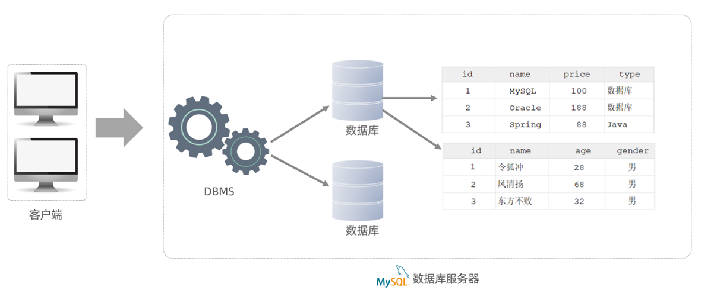
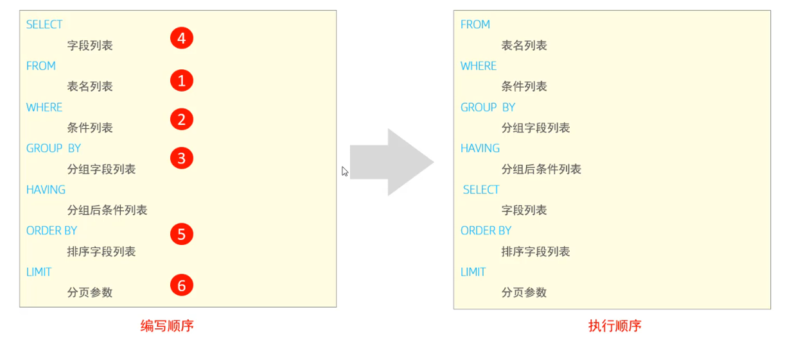
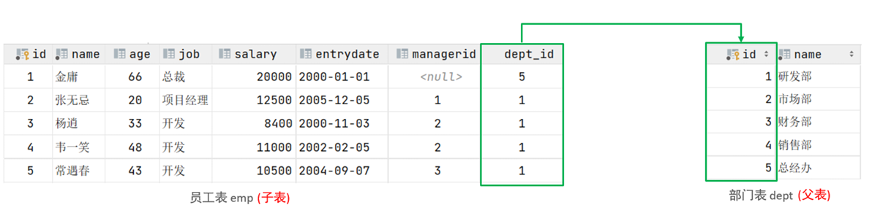
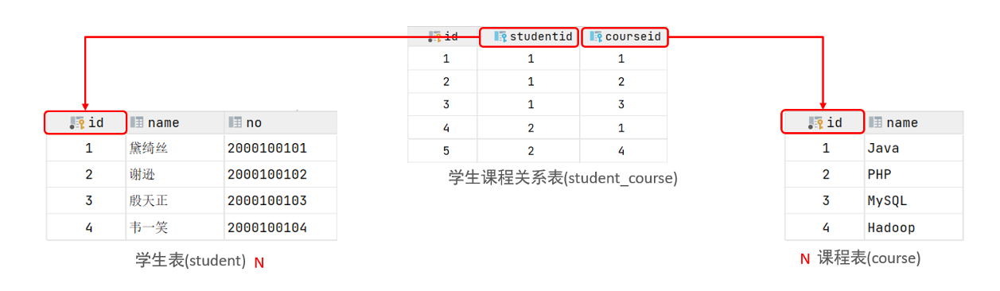
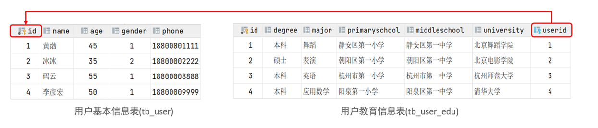
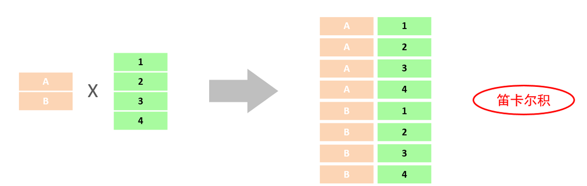
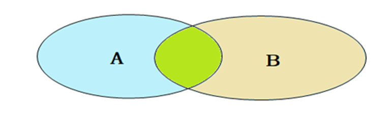
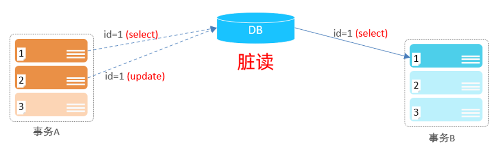
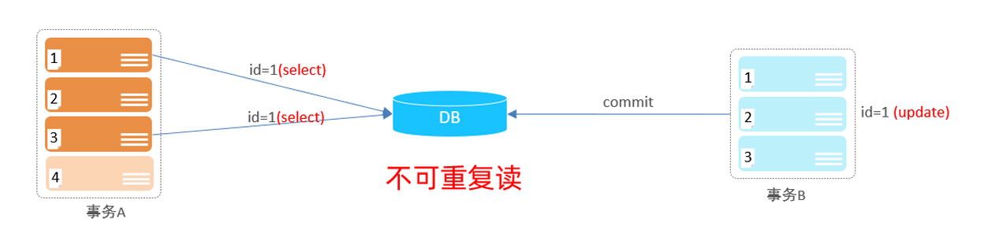
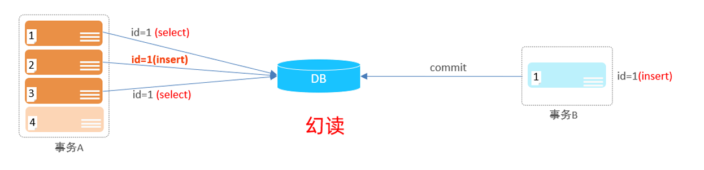

# 数据库

##  相关概念

数据库（Database DB）：存储数据的仓库，其中的数据是有组织的进行存储

数据库管理系统（Database Management System DBMS）：操纵和管理数据库的软件

SQL（Structured Query Language）：操作关系型数据库的编程语言，定义了操作关系型数据库的统一标准。

市面上有很多关系型数据库：
* Oracle：大型的收费数据库，Oracle公司产品，价格昂贵。
* MySQL：开源免费的中小型数据库，后来Sun公司收购了MySQL，而Oracle又收购了Sun公司。
目前Oracle推出了收费版本的MySQL，也提供了免费的社区版本。
* SQL Server：Microsoft 公司推出的收费的中型数据库，C#、.net等语言常用。
* PostgreSQL：开源免费的中小型数据库。

虽然有很多种关系型数据库，但是操作它们的语言是统一的，即 SQL

关系型数据库：建立在关系模型基础上，由多张相互连接的二维表组成的数据库。

二维表：由行和列组成的表，简单的说，基于二维表存储数据的数据库就是关系数据库。

关系数据库有以下两点特点：
* 格式统一，便于维护
* 使用 sql 语言操作，标准统一，使用方便


数据模型



* 我们可以通过MySQL客户端连接数据库管理系统DBMS，然后通过DBMS操作数据库。
* 使用SQL语句，通过数据库管理系统操作数据库，以及操作数据库中的表结构及数据。
* 一个数据库服务器中可以创建多个数据库，一个数据库中也可以包含多张表，而一张表中又可以包含多行记录。

## SQL


### 1.通用语法：
1. 可以单行或多行书写，以分号结尾
2. 可以使用空格/缩进增强语句可读性
3. MySQL 数据库的 SQL 不区分大小写，关键字建议使用大写
4. 注释：

	* 单行注释：-- 注释内容  或  # 注释内容
	* 多行注释：/* 注释内容 */

### 2. SQL 分类

SQL 语句分为四类：DDL、DML、DQL、DCL

| 分类 | 全称                       | 说明                                                 |
| ---- | -------------------------- | ---------------------------------------------------- |
| DDL  | Data Definition Language   | 数据定义语言，用来定义数据库对象（数据库，表，字段） |
| DML  | Data Manipulation Language | 数据操作语言，对数据库表中数据进行增删改             |
| DQL  | Data Query Language        | 数据查询语言，查询数据库中表的记录                   |
| DCL  | Data Control               | 数据控制语言，用来创建数据库用户、控制数据库访问权限 |


### 3. DDL

#### 3.1 数据库操作

```SQL
# 查询所有数据库
show databases;

# 查询当前数据库
select database();

# 创建数据库 []中参数可选；if not exists 解决创建数据库过程中重名报错问题
create database [ if not exists ] 数据库名 [ default charset 字符集 ] [ collate 排序规则 ] ;

# 删除数据库
drop database [if exists] 数据库名;

# 切换数据库
use 数据库名;

```

#### 3.2 表操作

```SQL

# 查询当前数据库所有表
show tables;

# 查看指定表结构
desc 表名;

# 查询指定表的建表语句
show create table 表名;

# 创建表结构
create table 表名(
	字段1 数据类型 [COMMENT 注释],
	字段2 数据类型 [COMMENT 注释],
	......
	字段n 数据类型 [COMMENT 注释]
)[COMMENT 表注释]

# 添加字段
alter table 表名 add 字段名 类型(长度) [comment 注释] [约束];

# 修改数据类型
alter table 表名 modify 字段名 新类型(长度) [comment 注释] [约束];

# 修改字段名和字段类型
alter table 表名 change 旧字段名 新字段名 新类型(长度) [comment 注释] [约束]；

# 删除字段
alter table 表名 drop 字段名;

# 修改表名
alter table 表名 rename to 新表名;

# 删除表
drop table [if exists] 表名

# 删除指定表，并重新创建
truncate table 表名;
```

> 注意：最后一个字段后没有逗号！！！ 
>
> 小结：DDL 中删除用的是 drop，修改表通过 alter table 表名 的方式指定表，对应修改字段 modify<change

数据类型分为三类：数值类型、字符串类型、日期类型

1. 数值类型

| 类型      | 大小 | 有符号范围                                            | 无符号范围                                                 |
| --------- | ---- | ----------------------------------------------------- | ---------------------------------------------------------- |
| TINYINT   | 1 B  | (-128, 127)                                           | (0，255)                                                   |
| SMALLINT  | 2 B  | (-32768, 32767)                                       | (0，65535)                                                 |
| MEDIUMINT | 3 B  | (-8388608, 8388607)                                   | (0，16777215)                                              |
| INT       | 4 B  | (-2147483648, 2147483647)                             | (0，4294967295)                                            |
| BIGINT    | 8 B  | (-2^63，2^63-1)                                       | (0，2^64-1)                                                |
| FLOAT     | 4 B  | (-3.402823466 E+38，3.402823466351 E+38)              | 0 和 (1.175494351 E 38，3.402823466 E+38)                  |
| DOUBLE    | 8 B  | (-1.7976931348623157 E+308，1.7976931348623157 E+308) | 0 和 (2.2250738585072014 E-308， 1.7976931348623157 E+308) |
| DECIMAL   |      | 依赖于M(精度)和D(标度) 的值                           | 依赖于M(精度)和D(标度)的 值                                |


2. 字符串类型

| 类型       | 大小                  | 描述                         |
| ---------- | --------------------- | ---------------------------- |
| char       | 0-255 bytes           | 定长字符串(需要指定长度)     |
| varchar    | 0-65535 bytes         | 变长字符串(需要指定长度)     |
| tinyblob   | 0-255 bytes           | 不超过255个字符的二进制数据  |
| tinytext   | 0-255 bytes           | 短文本字符串                 |
| blob       | 0-65 535 bytes        | 二进制形式的长文本数据       |
| text       | 0-65 535 bytes        | 长文本数据                   |
| mediumblob | 0-16 777 215 bytes    | 二进制形式的中等长度文本数据 |
| mediumtext | 0-16 777 215 bytes    | 中等长度文本数据             |
| longblob   | 0-4 294 967 295 bytes | 二进制形式的极大文本数据     |
| longtext   | 0-4 294 967 295 bytes | 极大文本数据                 |

> 注意：char 性能优于 varchar


3. 日期时间类型

| 类型      | 大小 | 范围                                       | 格式                | 描述      |
| --------- | ---- | ------------------------------------------ | ------------------- | --------- |
| date      | 3    | 1000-01-01 至 9999-12-31                   | YYYY-MM-DD          | 年月日    |
| time      | 3    | -838:59:59 至 838:59:59                    | HH:MM:SS            | 时分秒    |
| year      | 1    | 1901 至 2155                               | YYYY                | 年份      |
| datetime  | 8    | 1000-01-01 00:00:00 至 9999-12-31 23:59:59 | YYYY-MM-DD HH:MM:SS | 日期+时间 |
| datestamp | 4    | 1970-01-01 00:00:01 至 2038-01-19 03:14:07 | YYYY-MM-DD HH:MM:SS | 时间戳    |

表设计

设计一张学生信息表，如下：

1. 编号（id 自增）
2. 学号（字符串类型，定长 6）
3. 学生姓名（字符串类型，长度不超过 10 位）
4. 性别（男/女，存储一个汉字）
5. 年龄（没有负数）
6. 入学日期（date 类型）
7. 家庭住址（字符串类型，长度不超过 30）

对应建表语句：

```sql
create table stu(
	id int primary key auto_increment comment '学生编号',
    stu_number char(6) not null unique comment '学号',
    name varchar(10) not null comment '学生姓名'
    gender char(1) not null comment '性别'
    age tinyint unsighed check (age > 0 && age <= 150) comment '年龄',
    entry_date date comment '入学日期',
    address varchar(30) comment '家庭住址'
) comment '学生表';
```


### 4. DML (Data Manipulation Language)

用来对数据库中表的数据记录进行增删改操作。
* 添加数据（INSERT）
* 修改数据（UPDATE）
* 删除数据（DELETE）

1. 添加数据
```sql
# 给指定字段添加数据
INSERT INTO 表名(字段名1, 字段名2, ...) VALUES(值1, 值2, ...);

# 给全字段添加数据
INSERT INTO 表名 VALUES(值1, 值2, ...);

# 批量添加数据
INSERT INTO 表名 (字段名1, 字段名2, ...)  VALUES (值1, 值2, ...), (值1, 值2, ...), (值1, 值2, ...) ;

```
> 注意事项：
> * 插入数据时，指定字段顺序需要与值的顺序一一对应
> * 字符串和日期类型数据用引号括起来

2. 修改数据

```
UPDATE 表名 SET 字段名1 = 值1 , 字段名2 = 值2 , .... [ WHERE  条件 ] ;
```
> 注意：没有条件语句，则会修改整张表的所有数据

3. 删除数据

```
DELETE FROM 表名 [where 条件]
```

> 注意事项：
> * DELETE 语句的条件可以有，也可以没有，如果没有条件，则会删除整张表的所有数
据。与删除表不同的是，他不会删除表结构。
> *  DELETE 语句不能删除某一个字段的值(可以使用UPDATE，将该字段值置为NULL即
可)。

### 5. DQL
```SQL
SELECT
    字段列表
FROM
    表名列表
WHERE
    条件列表
GROUP  BY
    分组字段列表
HAVING
    分组后条件列表
ORDER BY
    排序字段列表
LIMIT
    分页参数
```

查询按照关键字拆分，可以分为以下几类：
* 基本查询（不带任何条件）
* 条件查询（where）
* 聚合函数（count、max、min、avg、sum）
* 分组查询（group by）
* 排序查询（order by）
* 分页查询（limit）

1. 基础查询

```sql
# 查询多个字段
select 字段1, 字段2, ... from 表名;
# 查询所有字段
select * from 表名;

# 字段设置别名
select 字段1 [as 别名1], 字段2 [as 别名2], ... from 表名;
select 字段1 [别名1], 字段2 [别名2], ... from 表名;
# 去除重复记录
select distinct 字段列表 from 表名;

```

2. 条件查询

```sql
select 字段列表 from 表名 where 条件列表;
```

常用比较运算符如下：

| 比较运算符          | 功能                                     |
| ------------------- | ---------------------------------------- |
| >                   | 大于                                     |
| <                   | 小于                                     |
| >=                  | 大于等于                                 |
| <=                  | 小于等于                                 |
| =                   | 等于                                     |
| != 或 <>            | 不等于                                   |
| between ... and ... | 在某个范围之间（含最大、最小值）         |
| in(...)             | 在列表中多选一                           |
| like 占位符         | 模糊匹配（_匹配单个字符，%匹配任意字符） |
| is null             | 是 NULL                                  |

常用逻辑运算符

| 逻辑运算符 | 功能 |
| ---------- | ---- |
| AND 或 &&  | 并且 |
| OR 或 \|\| | 或者 |
| NOT 或 ！  | 非   |


3. 聚合函数

将一列数据作为整体，进行**纵向计算**

常见聚合函数

| 函数  | 功能     |
| ----- | -------- |
| count | 统计数量 |
| avg   | 平均值   |
| min   | 最小值   |
| max   | 最大值   |
| sum   | 求和     |


```sql
# 语法
select 聚合函数(字段列表) from 表名;
```

> 注意：NULL 值不参与所有聚合函数的运算

4. 分组查询

```sql
SELECT  字段列表(分组字段或聚合函数)  FROM   表名  [ WHERE   条件 ]  GROUP   BY  分组字段名  [ HAVING  分组
后过滤条件 ];
```

> 注意：
>
> **where 与 having 的区别**：
>
> * 执行时机不同：where 是在分组之前过滤记录，不满足 where 条件的不参与分组；having 是在分组之后对结果进行过滤
> * 可判断条件不同：where 不能对聚合函数进行判断，having 可以
>
> 分组之后，查询的字段只能是聚合函数和分组字段，其他字段无意义
>
> 支持多字段分组，具体语法为 group by columnA， columnB


5. 排序查询

```sql
SELECT  字段列表  FROM   表名  ORDER  BY  字段1  排序方式1 , 字段2  排序方式2 ;
```

排序方式：

* ASC：升序（默认）
* DESC：降序

> 注意：多字段排序，当第一个字段值相同时，才会根据第二个字段进行排序

6. 分页查询

```sql
SELECT  字段列表  FROM   表名  LIMIT  起始索引, 查询记录数 ;
```

> 注意事项：
>
> * 起始索引从 0 开始，起始索引 = （查询页码 -1）* 每页显示记录数
> * 分页查询是数据库的方言，不同的数据库有不同的实现，MySQL中是LIMIT。
> * 如果查询的是第一页数据，起始索引可以省略，直接简写为 limit 10。


执行顺序与编写顺序



> 执行顺序的理解：首先确定查询哪个表，通过 where 进行一次过滤，将过滤后的记录分组，然后将分组后的记录再过滤，再在结果中选择字段列表，最后按照指定规则进行排序、分页。


### 6. DCL

数据库控制语言，用来管理数据库用户、控制数据库的访问权限。

#### 6.1 管理用户

```sql
# 查询用户
select * from mysql.user;

# 创建用户
CREATE USER '用户名'@'主机名' IDENTIFIED BY '密码';

# 修改用户密码
ALTER USER '用户名'@'主机名' IDENTIFIED WITH mysql_native_password BY '新密码' ;

# 删除用户
DROP USER '用户名'@'主机名' ; 
```

这类 SQL 开发人员操作较少，主要是 DBA (数据库管理员) 使用。

#### 6.2 权限控制

常用权限


| 权限                | 说明               |
| ------------------- | ------------------ |
| ALL, ALL PRIVILEGES | 所有权限           |
| SELECT              | 查询数据           |
| INSERT              | 插入数据           |
| UPDATE              | 修改数据           |
| DELETE              | 删除数据           |
| ALTER               | 修改表             |
| DROP                | 删除表/数据库/视图 |
| CREATE              | 创建数据库/表      |


```sql
# 查询权限
SHOW GRANTS FOR '用户名'@'主机名' ;
# 授予权限
GRANT 权限列表 ON 数据库名.表名 TO '用户名'@'主机名';
# 撤销权限
REVOKE 权限列表 ON 数据库名.表名 FROM '用户名'@'主机名';
```

## 函数

由 MySQL 提供的可以直接被另一段程序调用的程序或代码。MySQL 中的函数主要分为以下 4 类：字符串函数、数值函数、日期函数、流程函数

### 1. 字符串函数

| 函数                        | 功能                                                      |
| --------------------------- | --------------------------------------------------------- |
| concat(S1, S2, ...)         | 将 S1,S2, ... 拼接为一个字符串                            |
| lower (str)                 | 将 str 转化为小写                                         |
| upper (str)                 | 将 str 转化为大写                                         |
| lpad (str, n, pad)          | 左填充，用字符串 pad 对 str 左边填充，达到 n 个字符串长度 |
| rpad (str, n, pad)          | 右填充，用字符串 pad 对 str 右边填充，达到 n 个字符串长度 |
| trim (str)                  | 去除 str 前后的空格                                       |
| substring (str, start, len) | 返回字符串 str 从 start 起的 len 个长度的子串             |

### 2. 数值函数

| 函数        | 功能                                 |
| ----------- | ------------------------------------ |
| ceil (x)    | 向上取整                             |
| floor (x)   | 向下取整                             |
| mod (x,y)   | 返回 x/y 的模                        |
| rand ()     | 取 0~1 之间的随机数                  |
| round (x,y) | 求参数 x 四舍五入的值，保留 y 位小数 |

### 3. 日期函数

常见日期函数：

| 函数                                | 功能                                          |
| ----------------------------------- | --------------------------------------------- |
| curdate ()                          | 返回当前日期                                  |
| curtime ()                          | 返回当前时间                                  |
| now ()                              | 返回当前日期和时间                            |
| year (date)                         | 返回指定 date 的年份                          |
| month (date)                        | 返回指定 date 的月份                          |
| day (date)                          | 返回指定 date 的日                            |
| date_add (date, interval expr type) | 返回日期/时间加上一个时间间隔 expr 后的时间值 |
| datediff (date1, date2)             | 返回起始时间date1 和 结束时间date2之间的天 数 |

### 4. 流程函数

流程函数也是很常用的一类函数，可以在SQL语句中实现条件筛选，从而提高语句的效率。

| 函数                                                       | 功能                                                       |
| ---------------------------------------------------------- | ---------------------------------------------------------- |
| if (value, t, f)                                           | 如果value为true，则返回t，否则返回 f                       |
| ifnull (value1, value2)                                    | 如果value1不为空，返回value1，否则 返回value2              |
| case when [val1] then [res1] .. else [default] end         | 如果val1为true，返回res1，... 否 则返回default默认值       |
| case [expr] when [val1] then [res1] ... else [default] end | 如果expr的值等于val1，返回 res1，... 否则返回default默认值 |

## 约束

约束是作用于表中字段上的规则，用来限制表中的数据，为了保证数据库中数据的正确性、有效性和完整性。

约束可以分为以下几类：

| 约束                    | 描述                                                      | 关键字      |
| ----------------------- | --------------------------------------------------------- | ----------- |
| 非空约束                | 限制该字段数据不为空                                      | NOT NULL    |
| 唯一约束                | 保证该字段数据唯一                                        | UNIQUE      |
| 主键约束                | 一行数据的唯一标识，要求唯一且不为空                      | PRIMARY KEY |
| 默认约束                | 未指定该字段值，则采用默认值                              | DEFAULT     |
| 检查约束（8.0.16 版本） | 保证字段值满足一个条件                                    | CHECK       |
| 外键约束                | 用来让两张表的数据之间建立连接，保证数据的一致 性和完整性 | FOREIGN KEY |

> 注意：约束是作用在字段上的，创建表/修改表的时候都可以添加，通常约束跟在类型后。

### 外键约束

外键：用来让两张表的数据之间建立连接，从而保证数据的一致性和完整性。 

来看一个例子，emp 员工表中存储了部门 ID dept_id，而这个部门 ID 是关联部门表 dept 的主键 id，这时 emp 表的 dept_id 就是外键。



而外键分为逻辑外键和物理外键。目前上述两张表只是在逻辑上存在关联关系，在数据库层面，并未建立物理外键关联，所以无法保证数据一致性和完整性。具体体现在，删除部门表中 id = 1 的部门后，员工表中，仍然存在员工对应的部门 id 为 1. 想要解决这个问题可以通过数据库的外键约束：

```sql
# 建表时添加外键
CREATE TABLE 表名(
	字段名    数据类型,
	...
	[CONSTRAINT]  [外键名称] FOREIGN KEY (外键字段名) REFERENCES 主键（主表列名）
);

# 建表后添加外键
ALTER TABLE 表名 ADD CONSTRAINT 外键名称 FOREIGN KEY (外键字段名) REFERENCES 主键（主表列名）;

# 删除外键
ALTER TABLE 表名 DROP FOREIGN KEY 外键名称;
```


#### 删除/更新行为：

添加了外键之后，再删除父表数据时产生的约束行为，称为删除/更新行为。具体的删除/更新行 为有以下几种:

| 行为        | 说明                                                         |
| ----------- | ------------------------------------------------------------ |
| NO ACTION   | 当在父表中删除/更新对应记录时，首先检查该记录是否有对应外键，如果有则不允许删除/更新。 (与 RESTRICT 一致) 默认行为 |
| RESTRICT    | 当在父表中删除/更新对应记录时，首先检查该记录是否有对应外键，如果有则不允许删除/更新。 (与 NO ACTION 一致) 默认行为 |
| CASCADE     | 当在父表中删除/更新对应记录时，首先检查该记录是否有对应外键，如果有，则也删除/更新外键在子表中的记录 |
| SET NULL    | 当在父表中删除对应记录时，首先检查该记录是否有对应外键，如果有则设置子表中该外键值为null（这就要求该外键允许取null）。 |
| SET DEFAULT | 父表有变更时，子表将外键列设置成一个默认的值 (Innodb不支持)  |

具体语法：

```sql
ALTER TABLE  表名  ADD CONSTRAINT  外键名称  FOREIGN KEY  (外键字段)   REFERENCES   
主表名 (主表字段名)   ON UPDATE CASCADE ON DELETE CASCADE;
```


## 多表查询

### 1. 多表关系

项目开发中，在进行数据库表结构设计时，会根据业务需求及业务模块之间的关系，分析并设计表结 构，由于业务之间相互关联，所以各个表结构之间也存在着各种联系，基本上分为三种：

* 一对多
* 多对多
* 一对一

#### 1.1 一对多

部门与员工的关系：一个部门对应多个员工，一个员工对应一个部门。

实现：在多的一方，即员工方建立外键，指向一的一方，即部门的主键


#### 1.2 多对多

学生与课程的关系：一个学生可以选秀多门课程，一门课程可供多个学生选择

实现：建立第三张中间表，中间表至少包含两个外键，分别关联两方主键



#### 1.1 一对一

用户与用户详情的关系：用于单表拆分，将一张表的基础字段放在一张表，其他详情字段放在另一张表中，提升操作效率。

实现：在任意一方加入外键，关联另外一方的主键，并设置外键为唯一的（unique）



### 2. 多表查询

通过笛卡尔积从多张表中查询数据。

笛卡尔积：两个集合 A 和 B 的所有组合情况。



在多表查询中，我们的目标就是去除重复、无意义的笛卡尔积，只保留两张表关联部分的数据。具体体现在，在 SQL 语句中通过连接查询条件实现。

根据连接查询条件，可以将多表查询分为：

* 连接查询

  * 内连接
  * 左外连接
  * 右外连接
  * 自连接

  

* 子查询

#### 2.1 内连接

内连接查询的是两张表的交集，内连接的语法分为：隐式内连接、显示内连接

1. 隐式内连接

```sql
select 字段列表 from 表1, 表2 where 条件...;
```

2. 显示内连接

```sql
select 字段列表 from 表1 inner join 表2 on 连接条件 ...;
```

> 两种方式是等价的，可以相互转化

#### 2.2 外连接

1. 左外连接：查询表1(左表)的所有数据，当然也包含表1和表2交集部分的数据

```sql
select 字段列表 from 表1 left [outer] join 表2 on 条件...;
```

2. 右外连接：查询表2(右表)的所有数据，当然也包含表1和表2交集部分的数据

```sql
select 字段列表 from 表1 right [outer] join 表2 on 条件...;
```

> * 左外连接和右外连接可以相互替换
> * 一个例子区分内外连接：查询员工信息以及对应部门信息（内连接），查询所有员工信息以及对应部门信息（可能包含没有指定部门的员工）

#### 2.3 自连接

自己连接自己，也就是把一张表连接查询多次。

```sql
SELECT  字段列表   FROM   表A   别名A   JOIN  表A    别名B   ON  条件 ... ;
```

对于自连接查询，可以是内连接查询，也可以是外连接查询。

举例体验自连接：

* 查询员工及其所属领导名字，表结构：emp

```sql
select a.name emp_name, b.name manager_name from emp a, emp b where a.managerid = b.id
```

* 查询所有员工 emp 及其领导的名字 emp , 如果员工没有领导, 也需要查询出来，表结构 emp

```sql
select a.name '员工', b.name '领导' from emp a left join emp b on a.managerid = 
b.id;
```

> 注意：**自连接中必须为表起别名，否则不清楚所指的条件、返回的字段到底是哪一张表的字段

#### 2.4 联合查询

对于union查询，就是把多次查询的结果合并起来，形成一个新的查询结果集。

```sql
SELECT  字段列表   FROM   表A  ...  
UNION [ ALL ]
SELECT  字段列表  FROM   表B  ....;
```

> 注意：
>
> * 对于联合查询的多张表的列数必须保持一致，字段类型也需要保持一致。（增加行记录数）
> * union all 会将全部的数据直接合并在一起，union 会对合并之后的数据去重。

#### 2.6 子查询

SQL语句中嵌套SELECT语句，称为嵌套查询，又称子查询。

```sql
SELECT  *  FROM   t1   WHERE  column1 =  ( SELECT  column1  FROM  t2 );
```

子查询外部的语句可以是INSERT / UPDATE / DELETE / SELECT 的任何一个。

根据子查询结果不同，可以分为：

* 标量子查询（子查询结果为单个值）
* 列子查询（结果为一列）
* 行子查询（结果为一行）
* 表子查询（结果为多行多列）

根据子查询位置，又可以分为：

* where 之后
* from 之后
* select 之后

1. 标量子查询

子查询返回的结果是单个值（数字、字符串、日期等），最简单的形式，这种子查询称为标量子查询。

常用的操作符：=  <>  >   >=   <  <= 

案例：

A. 查询 ”销售部“ 的所有员工信息

完成这个需求，可以分为两步：

a. 查询 "销售部" 部门 id

```sql
select id from dept where name = '销售部'
```

b. 根据 "销售部" id 查询员工信息

```sql
select * from emp where dept_id = (select id from dept where name = '销售部')
```

2. 列子查询


子查询返回的结果是一列（可以是多行），这种子查询称为列子查询。

常用的操作符：IN 、NOT IN 、 ANY 、SOME 、 ALL

| 操作符 | 描述                                   |
| ------ | -------------------------------------- |
| IN     | 在指定的集合范围之内，多选一           |
| NOT IN | 不在指定的集合范围之内                 |
| ANY    | 子查询返回列表中，有任意一个满足即可   |
| SOME   | 与ANY等同，使用SOME的地方都可以使用ANY |
| ALL    | 子查询返回列表的所有值都必须满足       |

案例：

A. 查询销售部和市场部的所有员工信息

分解为下面两步：

a. 查询销售部和市场部的 id

```sql
select id from dept where name = '销售部' or name = '市场部';
```

b. 根据部门 id，查询员工信息

```sql
select * from emp where dept_id in (select id from dept where name = '销售部' or name = '市场部');
```


3. 行字查询

子查询返回的结果是一行（可以是多列），这种子查询称为行子查询。

常用的操作符：= 、<> 、IN 、NOT IN

案例：

A. 查询与张无忌的薪资以及直属领导相同的员工信息

a. 查询张无忌的薪资以及直属领导

```sql
select salary, managerid from emp where name = '张无忌';
```

b. 根据薪资与直属领导，查询员工信息

select * from emp where (salary, manageid) = (select salary, managerid from emp where name = '张无忌');


4. 表子查询

子查询返回的结果是多行多列，这种子查询称为表子查询。

常用的操作符：IN

案例：

A. 查询与 "鹿杖客" , "宋远桥" 的职位和薪资相同的员工信息

分两步查询：

a. 查询 "鹿杖客" , "宋远桥" 的职位和薪资

```sql
select slary, job from emp where name = '鹿杖客' or name = '宋远桥';
```

b. 查询与 "鹿杖客" , "宋远桥" 的职位和薪资相同的员工信息

```sql
select * from emp where (slary,job) in (select slary, job from emp where name = '鹿杖客' or name = '宋远桥');
```


## 事务

### 1. 事务介绍

事务是一组操作的集合，它会把集合中的所有操作作为一个整体向系统提交或撤销，在事务中的操作要么同时成功，要么同时失败。

> 注意：默认MySQL的事务是自动提交的，也就是说，当执行完一条DML语句时，MySQL会立即隐 式的提交事务。

### 2. 事务操作

#### 事务控制方式一

修改了事务的自动提交行为, 把默认的自动提交修改为了手动提交, 此时执行的 DML 语句都不会提交, 通过手动的执行 commit 进行提交。

```sql
# 查看/设置事务提交方式
select @@autocommit;

set @@autocommit = 0;

# 提交事务
commit;

# 回滚事务
rollback;
```

#### 事务控制方式二

```sql
# 开启事务
start transaction 或 begin;

# 提交事务
commit;

# 回滚事务
rollback;
```

### 3. 事务的四大特性

* 原子性（Atomicity）：事务是不可分割的最小操作单元，要么全部成功，要么全部失败。
* 一致性（Consistency）：事务完成时，所有数据保持一致
* 隔离性（Isolation）：事务在不受外部并发操作的影响独立运行
* 永久性（Durability）：事务一旦提交或回滚，它对数据库中的数据的改变是永久的

### 4. 并发事务的问题

* 脏读：一个事务读到另外一个事务还没有提交的数据



事务 B 读取到了 A 未提交的数据。

* 不可重复读：一个事务先后读取同一条记录，但是两次读取的数据不同



在事务 A 两次读取数据中间，事务 B 提交了对数据的修改。

* 幻读：一个事务按照条件查询数据时，没有对应的数据行，但是在插入数据时，又发现这行数据 已经存在，好像出现了 "幻影"。



### 5. 事务隔离级别

为了解决并发事务所引发的问题，在数据库中引入了事务隔离级别。主要有以下几种：

| 隔离级别                | 脏读 | 不可重复读 | 幻读 |
| ----------------------- | ---- | ---------- | ---- |
| Read uncommitted        | √    | √          | √    |
| Read committed          | ×    | √          | √    |
| Repeatable Read（默认） | ×    | ×          | √    |
| Serializable            | ×    | ×          | ×    |

```sql
# 查看事务隔离级别
SELECT @@TRANSACTION_ISOLATION;

# 设置事务隔离级别
SET  [ SESSION | GLOBAL ]  TRANSACTION  ISOLATION  LEVEL  { READ UNCOMMITTED | 
READ COMMITTED | REPEATABLE READ | SERIALIZABLE }
```

> 注意：事务隔离级别越高，数据越安全，但是性能越低。


## 总结

1. 建表过程中，最后一个字段后没有 ，其余字段均有 ，
2. 每条语句以 ; 结尾
3. 对于数据行的删除用关键字 delete，对于表、数据库、视图的删除用关键字 drop
4. 删除表中全部数据与删除表不同
5. 约束条件在数据类型后
6. DQL 的执行顺序：选表、where 过滤、分组、分组后过滤、选择字段、排序、分页
7. 联合查询是合并两个结果集，子查询是在结果集的基础上在进行查询，子查询的结果集可以作为条件也可以作为表，也可以作为选择字段
8. 涉及子查询的复杂查询，可以分步查询，实现目标。
9. 并发事务的三大问题：脏读、不可重复读、幻读

