## 1. 视图/存储过程/触发器

### 1.1 视图

#### 介绍

视图（view）是虚拟存在的表，它的数据并不在数据库中实际存在，其行和列的数据是使用视图时，根据定义视图时的语句动态生成的。

简单的说，视图只保留了查询的 SQL 逻辑，没有查询结果，结果是使用时动态生成。

#### 语法

```sql
# 创建
create [or replace] view 视图名称[(列名列表)] as select语句 [with [cascaded | local] check option];

# 查询创建语句
show create view 视图名称;

# 查询视图数据
select * from 视图名称;

# 修改
create or replace view 视图名称[(列名列表)] as select语句 [with [cascaded | local] check option];

alter view 视图名称[(列名列表)] as select语句 [with [cascaded | local] check option];

# 删除
drop view [if exists] 视图名称;

```

对视图进行 DML，如果遵循原来的表的字段约束，则可以影响到原来的表。如果我们定义视图时，指定了条件，然后我们在插入、修改、删除数据时，是否可以做到必须满足定义视图时的条件才能操作，否则不能够操作呢？ 答案是可以的，这就需要借助于视图的检查选项了。

#### 检查选项

当使用 WITH CHECK OPTION 子句创建视图时，MySQL会通过视图检查正在更改的每个行，例如 插入，更新，删除，以使其符合视图的定义。

MySQL 允许基于另一个视图创建视图，它还会检查依赖视图中的规则以保持一致性。为了确定检查的范围，mysql提供了两个选项： CASCADED 和 LOCAL ，默认值为 CASCADED 

cascaded：V2 基于 V1，且 V2 指定检查范围为 cascaded，则在检查时，不仅会检查 V2，还会级联检查 V1

local：V2 基于 V1，且 V2 指定检查范围为 local，则在检查时，只会检查 V2 的规则

> 更新视图时需要注意：
> * 更新视图的字段值要满足原表的约束
> * 如果有 with check option 且指定检查范围为级联，则还需要满足自身视图约束以及依赖视图的约束
> * 要更新视图，视图中的行于基础表中的行之间存在一对一关系，这意味着使用了分组、函数、去重、分组后过滤、并表操作的视图无法增删改。

#### 视图的作用
视图可以简化用户对数据的操作：经常使用的查询可以被定义为视图，从而使用户不必每次操作都指定全部条件（相当于函数作用）
视图安全：数据库可以授权，但是不能授权到数据库特定行和特定列上。通过视图，用户只能查询和修改他们见到的数据（访问权限）
数据独立：帮助用户屏蔽真实表结构变化带来的影响（相当于封装）

### 1.2 存储过程

阿里开发手册中明确禁止使用存储过程，这部分只做了解。

存储过程思想上很简单，就是数据库 SQL 语言层面的代码封装与重用。相当于函数调用，可以有返回值、可以有参数

#### 基本语法
```sql
# 创建
create procedure 存储过程名([参数列表])
begin

	-- SQL 语句
	
end;

# 调用
call 存储过程名([参数]);

# 查询某个存储过程的定义
show create procedure 存储过程名;

# 删除
drop procedure [if exists] 存储过程名;

```

#### 变量
三种变量：系统变量、用户变量、局部变量。

只用关注系统变量与用户变量：
```sql
# 查看所有系统变量(模糊匹配变量名)
show [global | session] variables [like '.....'];

# 查看指定变量的值
select @@[global | session] 系统变量名;

# 设置系统变量
set [session | global] 系统变量名 = 值；
set @@[sesion | global] 系统变量名 = 值；

```
> 注意
> * 如果没有指定SESSION/GLOBAL，默认是SESSION，会话变量。
> * MySQL 服务重启后，设置的全局参数会失效，想要不失效，需要修改 my.cnf 配置文件。这说明每次启动服务，MySQL 会从配置文件中加载参数。

用户变量作用域为当前连接，是用户根据需要自己定义的变量，用户变量不用提前声明，在用的时候直接用 "@变量名" 。

```sql
# 赋值
set @变量名 = expr [, @变量名 = expr]...;
set @变量名 := expr [, @变量名 = expr]...; // = 与 := 等价

select @变量名 = expr [,@变量名 = expr]...;
select 字段名 into @变量名 from 表名;

# 使用
select @变量名

```
> 注意: 用户定义的变量无需对其进行声明或初始化，只不过获取到的值为NULL。


为了更好的实现存储过程的功能，这里还有 if, case, while, repeat, loop, cursor (游标) 等流程控制语法。

#### 存储函数
有返回值的存储过程：
```sql
create function 存储函数名([参数列表])
returns type [characteristic ...]
begin
	-- Sql 语句
	return ...;
	
end;

```

### 1.3 触发器

触发器是与表有关的数据库对象，指在 insert/update/delete 之前 (BEFORE) 或之后 (AFTER)，触
发并执行触发器中定义的SQL语句集合。

应用场景：确保数据的完整性 , 日志记录 , 数据校验等操作 。

使用别名 OLD 和 NEW 来引用触发器中**发生变化的记录内容**，这与其他的数据库是相似的。现在触发器还只支持行级触发，不支持语句级触发。

| 触发器类型      | NEW 和 OLD                                               |
| --------------- | -------------------------------------------------------- |
| INSERT 型触发器 | NEW 表示将要（insert 前）或者已经（insert 后）新增的数据 |
| UPDATE 型触发器 | OLD 表示修改之前的数据，NEW 表示将要或已经修改的数据     |
| DELETE 型触发器 | OLD 表示将要或已经删除的数据                             |

#### 语法

```sql
# 创建
create trigger trigger_name
before/after insert/update/delete
on table_naem for each row
begin
	-- sql语句
end;

# 查看
show triggers;

# 删除
drop trigger [schema_name.]trigger_nane; -- 没有指定数据库，默认当前数据库
```

## 2. 锁

### 2.1 概述

锁是计算机协调多个进程或线程并发访问某一资源的机制。

在数据库中，除传统的计算资源（CPU、RAM、I/O）的争用以外，数据也是一种供许多用户共享的资源。数据库锁要求：保证数据并发访问的一致性、有效性，同时尽量减少锁冲突对并发访问性能的影响。从这个角度来说，锁对数据库而言显得尤其重要，也更加复杂。

MySQL 中按照锁的粒度可以将锁分为：
* 全局锁：锁定数据库中所有表
* 表级锁：每次操作锁住整张表
* 行级锁：每次操作锁对应的行

### 2.2 全局锁

全局锁就是对整个数据库实例加锁，加锁后整个实例就处于只读状态，后续的DML的写语句，DDL语句，**已经更新操作的事务提交语句**都将被阻塞。

应用场景：全库的逻辑备份，对所有表加锁，从而获取一致性视图，保证数据完整性。

#### 语法
```sql
# 加全局锁
flush tables with read lock;

# 数据备份
mysqldump -uroot -p1234 itcast > itcast.sql

# 释放锁
unlock tables;

```

数据库中加全局锁，是一个比较重的操作，严重影响性能。在 InnoDB 引擎中，可以通过加上参数 `--single-transaction` 来完成不加锁的一致性数据备份

```sql
mysqldump --single-transaction -uroot -p1234 itcast > itcast.sql
```

### 2.3 表级锁

表级锁，每次操作锁住整张表。锁定粒度大，发生锁冲突的高，并发度低。应用在MyISAM、InnoDB、BDB等存储引擎中。

对于表级锁，又分为三类：
* 表锁
* 元数据锁（meta data lock，MDL）
* 意向锁

#### 表锁
对于表锁，可分为：

* 表共享读锁（read lock）
* 表独占写锁（write lock）

语法：
```sql
# 加锁
lock tables 表名... read/write;

# 释放锁
unlock tables;/ 客户端断开连接
```
> 读锁不会阻塞其他客户端的读，但是会阻塞写。写锁既会阻塞其他客户端的读，又会阻塞
其他客户端的写。

#### 元数据锁（MDL）

MDL 加锁过程是**系统自动控制**，无需显式使用，在访问一张表的时候会自动加上。MDL 锁主要作用是为了避免DML与DDL冲突，保证读写的正确性。

这里的元数据，可以理解为一张表的表结构。 也就是说，某一张表涉及到未提交的事务时，是不能够修改这张表的表结构的。

在 MySQL5.5 中引入了 MDL，当对一张表进行增删改查的时候，加 MDL读锁 (SHARE_READ/ SHARE_WRITE)；当对表结构进行变更操作的时候，加 MDL 写锁 (EXCLUSIVE)。

常见 SQL 操作所自动添加的元数据锁：

| 对应 SQL                                        | 锁类型                                  | 说明                                                |
| ----------------------------------------------- | --------------------------------------- | --------------------------------------------------- |
| lock tables xxx read / write                    | SHARED_READ_ONLY / SHARED_NO_READ_WRITE |                                                     |
| select 、select ... lock in share mode          | SHARED_READ                             | 与 SHARED_READ、SHARE_WRITE 兼容，与 EXCLUSIVE 互斥 |
| insert 、update、 delete、select ... for update | SHARED_WRITE                            | 与 SHARED_READ、 SHARED_WRITE兼容，与 EXCLUSIVE互斥 |
| alter table ...                                 | EXCLUSIVE                               | 与其他的MDL都互斥                                   |

> 注意：这里讨论的是元数据锁，系统自动加锁，与前面提到的手动加的表锁不同。

#### 意向锁

为了避免 DML 在执行时，加的行锁与表锁的冲突，在 InnoDB 中引入了意向锁，使得表锁不用检查每行数据是否加锁，使用意向锁来减少表锁的检查。

通过一个例子来体会意向锁：

假如没有意向锁，客户端一对表加了行锁后，客户端二如何给表加表锁呢，来通过示意图简单分析一 下：

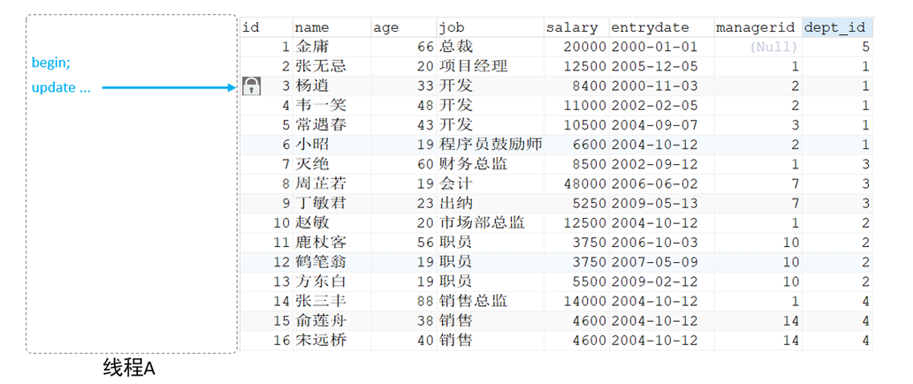

* 首先客户端一，开启一个事务，然后执行DML操作，在执行DML语句时，会对涉及到的行加行锁。
* 当客户端二，想对这张表加表锁时，会检查当前表是否有对应的行锁，如果没有，才会添加表锁，此时就会从第一行数据，检查到最后一行数据，效率较低。

有了意向锁之后：

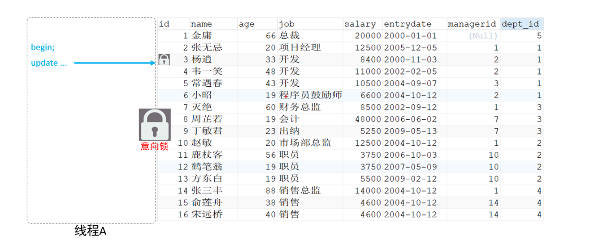

* 客户端一，在执行DML操作时，会对涉及的行加行锁，同时也会对该表加上意向锁。
* 而其他客户端，在对这张表加表锁的时候，会根据该表上所加的意向锁来判定是否可以成功加表锁，而不用逐行判断行锁情况了。

**意向锁也可以分为意向共享锁和意向排他锁**：

* 意向共享锁（IS）：由语句 `select ... lock in share mode` 添加，与表锁中的读锁兼容，于写锁互斥。
* 意向排他锁（IX）：由 `insert`、`update`、`delete`、`select ... for update` 添加，与表锁中的读锁、写锁都互斥

> 注意：
> * 意向锁之间不会互斥：因为意向锁使用了简化表锁与行锁互斥判断的。
> * 一旦事务提交了，意向共享锁、意向排他锁，都会自动释放。

### 2.4 行级锁

#### 1. 介绍

行级锁，每次操作锁住对应的行数据。锁定粒度最小，发生锁冲突的概率最低，并发度最高。应用在 InnoDB存储引擎中。

InnoDB 的数据是基于索引组织的，行锁是通过对索引上的**索引项加锁**来实现的，而**不是对记录加锁**。对于行级锁，主要分为以下三类：

* 行锁（Record lock）：锁定单个行记录的锁，防止其他事务对此行进行 update 和 delete。

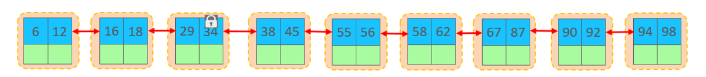

* 间隙锁（Gap lock）：锁定索引记录间隙（不含该记录），确保索引记录间隙不变，防止其他事
务在这个间隙进行insert，产生幻读（读的时候没有，插得时候又出现了）。

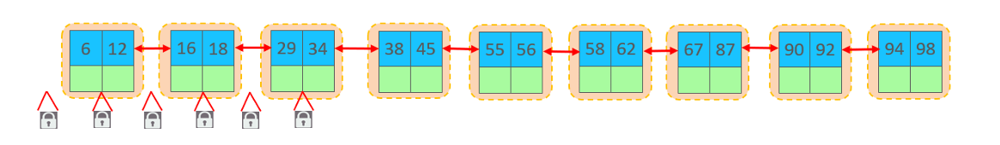

* 临建锁（Next-Key lock）：行锁和间隙锁组合，同时锁住数据，并锁住数据前面的间隙Gap。

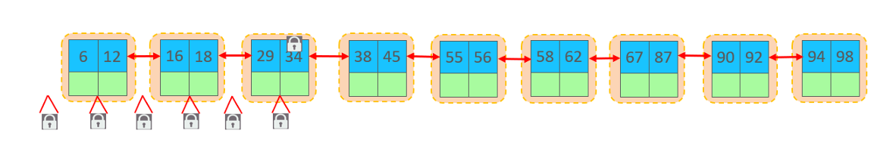


#### 2. 行锁（Record lock）

InnoDB 实现了两种行锁：

* 共享锁（S）：允许一个事务去读一行，阻止其他事务获得相同数据集的排它锁
* 排它锁（X）：允许获取排他锁的事务更新数据，阻止其他事务获得相同数据集的共享锁和排他
锁。

常见的 SQL 语句，在执行时所加的行锁如下：

| SQL                           | 行锁类型    | 说明                      |
| ----------------------------- | ----------- | ------------------------- |
| INSERT                        | 排它锁（X） | 自动加锁                  |
| UPDATE                        | 排它锁（X） | 自动加锁                  |
| DELETE                        | 排它锁      | 自动加锁                  |
| SELECT                        | 不加锁      |                           |
| SELECT ... LOCK IN SHARE MODE | 共享锁      | 手动加 lock in share mode |
| SELECT ... FOR UPDATE         | 排它锁      | 手动加 for update         |

> 注意：InnoDB 的行锁是针对于索引加的锁，不通过索引条件检索数据，那么 InnoDB 将对表中的所有记录加锁，此时就会升级为表锁。

#### 3. 间隙锁&临建锁

默认情况下，InnoDB在 REPEATABLE READ事务隔离级别运行，InnoDB使用 next-key 锁进行搜索和索引扫描，以防止幻读。

* 索引上的等值查询(唯一索引)，给不存在的记录加锁时, 优化为间隙锁。
* 索引上的等值查询(唯一索引)，给存在的记录加锁时, 优化为行锁 。
* 索引上的等值查询(非唯一普通索引)，向右遍历时最后一个值不满足查询需求时，next-key  lock 退化为间隙锁。假如，根据下图索引查询值为18的数据，由于是非唯一普通索引，后续可能还有多个18，加锁时会继续往后找，找到不满足条件的值，也就是29，此时会对18加临建锁，并对29之前的间隙加锁。

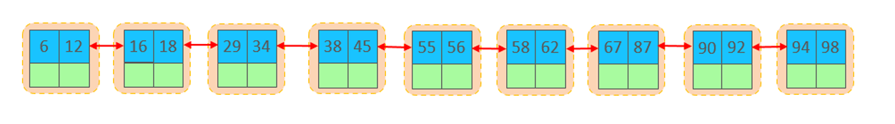

* 索引上的范围查询(唯一索引)会访问到不满足条件的第一个值为止

> 注意：间隙锁唯一目的是防止其他事务插入间隙。间隙锁可以共存，一个事务采用的间隙锁不会阻止另一个事务在同一间隙上采用间隙锁。

通过以下 sql 可以查看意向锁和行锁的加锁情况：

```sql
select object_schema,object_name,index_name,lock_type,lock_mode,lock_data from 
performance_schema.data_locks;
```

## 3. InnoDB 引擎

InnoDB 存储引擎数据是按行进行存放的，在行中，默认有两个隐藏字段：

* Trx_id：每次对某条记录进行改动时，都会把对应的事务id赋值给trx_id隐藏列。
* Roll_pointer：每次对某条引记录进行改动时，都会把旧的版本写入到undo日志中，然后这个隐藏列就相当于一个指针，可以通过它来找到该记录修改前的信息。

### 3.1 架构

#### 1. 概述

MySQL5.5 版本开始，默认使用InnoDB存储引擎，它擅长事务处理，具有崩溃恢复特性，在日常开发 中使用非常广泛。下面是InnoDB架构图，左侧为内存结构，右侧为磁盘结构。

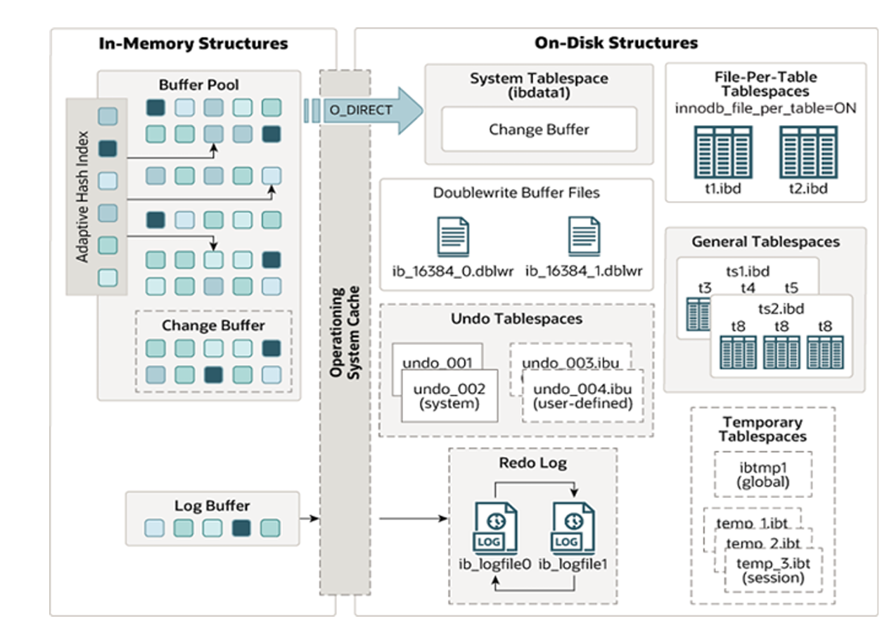

#### 2. 内存结构

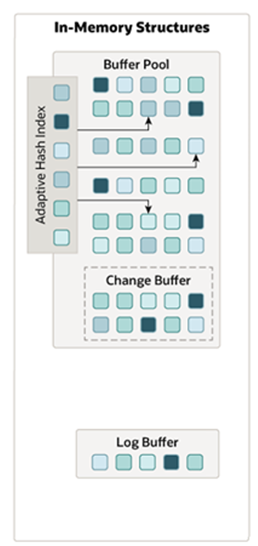

在内存结构中，主要分为四大块： Buffer Pool、Change Buffer、Adaptive 
Hash Index、Log Buffer。 

##### Buffer Pool
InnoDB 存储引擎基于磁盘文件存储，访问物理硬盘和在内存中进行访问，速度相差很大，为了尽可能弥补这两者之间的I/O效率的差值，就需要把经常使用的数据加载到内存缓冲池中，避免每次访问都进行磁盘I/O。

缓冲池中不仅缓存了索引页和数据页，还包含了undo页、插入缓存、自适应哈希索引以及 InnoDB的锁信息等等。

缓冲池 Buffer Pool，是主内存中的一个区域，里面可以缓存磁盘上经常操作的真实数据，在执行增删改查操作时，先操作缓冲池中的数据（若缓冲池没有数据，则从磁盘加载并缓存），然后再以一定频率刷新到磁盘，从而减少磁盘IO，加快处理速度。

缓冲池以Page页为单位，底层采用链表数据结构管理Page。根据状态，将Page分为三种类型：

* free page：未使用的 page
* clean pare：数据没有被修改过的、被使用 page
* dirty page：脏页，数据被修改过的、被使用的 page，即内存数据与磁盘数据不一致

在专用服务器上，通常将多达80％的物理内存分配给缓冲池 。参数设置：  `show variables  like 'innodb_buffer_pool_size';`

##### Change Buffer

Change Buffer，更改缓冲区（针对于**非唯一二级索引页**），在执行DML语句时，如果这些数据Page 没有在Buffer Pool中，不会直接操作磁盘，而会将数据变更存在更改缓冲区 Change Buffer  中，在未来数据被读取时，再将数据读取并合并恢复到Buffer Pool中，再将合并后的数据刷新到磁盘中。

与聚集索引不同，二级索引通常是非唯一的，并且以相对随机的顺序插入二级索引。同样，删除和更新可能会影响索引树中不相邻的二级索引页，如果每一次都操作磁盘，会造成大量的磁盘IO。有了 ChangeBuffer之后，我们可以在缓冲池中进行合并处理，减少磁盘IO。

##### Adaptive Hash Index

自适应 hash 索引，用于优化对Buffer Pool数据的查询。MySQL的 InnoDB 引擎中虽然没有直接支持 hash索引，但提供了自适应 hash 索引。hash索引在进行等值匹配时，一般性能是要高于B+树的，因为hash索引一般只需要一次IO即可，而B+树，可能需要几次匹配，所以hash索引的效率要高，但是hash索引又不适合做范围查询、模糊匹配等。

InnoDB存储引擎会监控对表上各索引页的查询，如果观察到在特定的条件下hash索引可以提升速度， 则建立hash索引，称之为自适应hash索引。

**自适应哈希索引，无需人工干预，是系统根据情况自动完成。**

##### Log Buffer

日志缓冲区，用来保存要写入到磁盘中的 log 日志数据（redo log 、undo log）， 默认大小为 16MB，日志缓冲区的日志会定期刷新到磁盘中。如果需要更新、插入或删除许多行的事务，增加日志缓冲区的大小可以节省磁盘 I/O（避免频繁刷新日志到磁盘中）。

#### 3 磁盘结构

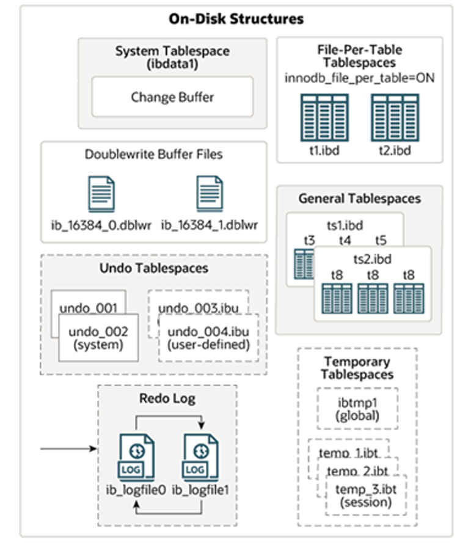

##### System Tablespace

系统表空间是更改缓冲区的存储区域（落盘位置）。如果表是在系统表空间而不是每个表文件或通用表空间中创建的，它也可能包含表和索引数据。

##### File-Per-Table Tablespaces

如果开启了`innodb_file_per_table`开关 ，则每个表的文件表空间包含单个InnoDB表的数据和索引 ，并存储在文件系统上的单个数据文件中。

##### General Tablespaces

通用表空间，需要通过 CREATE TABLESPACE 语法创建通用表空间，在创建表时，可以指定该表空
间。

```sql
# 创建表空间
CREATE TABLESPACE ts_name  ADD  DATAFILE  'file_name' ENGINE = engine_name;

# 创建表时指定表空间
CREATE  TABLE   ...  TABLESPACE  ts_name

```

##### Undo Tablespaces

撤销表空间，MySQL实例在初始化时会自动创建两个默认的undo表空间（初始大小16M），用于存储 undo log日志。

##### Temporary Tablespaces

InnoDB 使用会话临时表空间和全局临时表空间。存储用户创建的临时表等数据。

##### Doublewrite Buffer Files

双写缓冲区，innoDB引擎将数据页从Buffer Pool刷新到磁盘前，先将数据页写入双写缓冲区文件
中，便于系统异常时恢复数据。

##### Redo Log

重做日志，是用来实现事务的持久性。该日志文件由两部分组成：重做日志缓冲（redo log 
buffer）以及重做日志文件（redo log）,前者是在内存中，后者在磁盘中。当事务提交之后会把所
有修改信息都会存到该日志中, 用于在刷新脏页到磁盘时,发生错误时, 进行数据恢复使用。

#### 4. 后台线程

内存中所更新的数据，是通过后台线程到磁盘中的。在InnoDB的后台线程中，分为4类，分别是：Master Thread 、IO Thread、Purge Thread、Page Cleaner Thread。

##### Master Thread

核心后台线程，负责调度其他线程，还负责将缓冲池中的数据异步刷新到磁盘中, 保持数据的一致性， 还包括脏页的刷新、合并插入缓存、undo页的回收 。

##### IO Thread

在InnoDB存储引擎中大量使用了AIO来处理IO请求, 这样可以极大地提高数据库的性能，而 IO  Thread主要负责这些IO请求的回调。

| 线程类型             | 默认个数 | 职责                         |
| -------------------- | -------- | ---------------------------- |
| Read Thread          | 4        | 负责读操作                   |
| Write Thread         | 4        | 负责写操作                   |
| Log Thread           | 1        | 负责将日志缓冲区刷新到磁盘   |
| Insert buffer thread | 1        | 负责将写缓冲区内容刷新到磁盘 |

##### Purge Thread

主要用于回收事务已经提交了的undo log，在事务提交之后，undo log可能不用了，就通过它来回收。

##### Page Cleaner Thread

协助 Master Thread 刷新脏页到磁盘的线程，它可以减轻 Master Thread 的工作压力，减少阻塞。


### 3.2 事务原理

#### 1. 事务的特性

* 原子性（Atomicity）：事务是不可分割的最小操作单元，要么全部成功，要么全部失败。
* 一致性（Consistency）：事务完成时，必须使所有的数据都保持一致状态。
* 隔离性（Isolation）：保证事务在不受外部并发操作影响的独立环境下运行。
* 持久性（Durability）：事务一旦提交或回滚，它对数据库中的数据的改变就是永久的。

事务的原理，本质上就是弄清楚 ACID 时怎么实现的。

原子性、一致性、持久化是通过 redo log、undo log 日志实现的。隔离性是通过数据库的锁，加上 MVCC 来实现的。

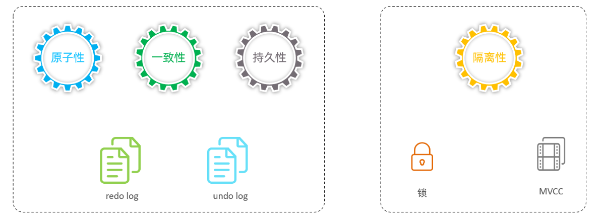

#### 2. redo log

重做日志，记录了事务提交时数据页的物理修改，保证了事务的持久化。

该日志文件由两部分组成：重做日志缓冲（redo log buffer）以及重做日志文件（redo log 
file）,前者是在内存中，后者在磁盘中。当事务提交之后会把所有修改信息都存到该日志文件中, 用
于在刷新脏页到磁盘发生错误时, 进行数据恢复使用。

如果没有 redo log：

当我们在一个事务中，执行多个增删改的操作时，InnoDB引擎会先操作缓冲池中的数据，如果
缓冲区没有对应的数据，会通过后台线程将磁盘中的数据加载出来，存放在缓冲区中，然后将缓冲池中的数据修改，修改后的数据页我们称为脏页。 而脏页则会在一定的时机，通过后台线程刷新到磁盘中，从而保证缓冲区与磁盘的数据一致。 而缓冲区的脏页数据并不是实时刷新的，而是一段时间之后将缓冲区的数据刷新到磁盘中，假如刷新到磁盘的过程出错了，而提示给用户事务提交成功，而数据却没有持久化下来，这就出现问题了，没有保证事务的持久性。

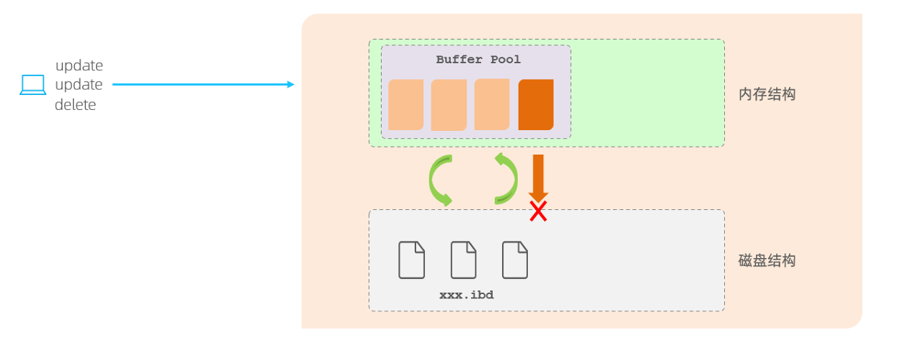

简单来说这个结果是由于数据页的修改与刷新到磁盘不是同步导致的。

为了解决上述问题，引入了 redo log：

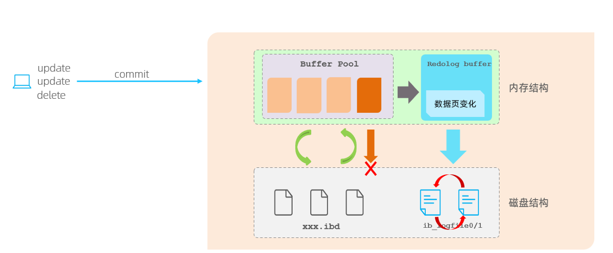

有了 redolog 之后，当对缓冲区的数据进行增删改之后，会首先将操作的数据页的变化，记录在redo log buffer中。**在事务提交时，会将 redo log buffer 中的数据立即刷新到 redo log 磁盘文件中。** 过一段时间之后，如果刷新缓冲区的脏页到磁盘时，发生错误，此时就可以借助于redo log进行数据恢复，这样就保证了事务的持久性。 而如果脏页成功刷新到磁盘或者涉及到的数据已经落盘，此时 redo log ，就可以删除了，所以存在的两个 redo log 文件是循环写的。

> 思考：为什么每一次提交事务，要刷新 redo log 到磁盘中呢，而不是直接将 buffer pool 中的脏页刷新到磁盘呢 ?
>
> 因为在业务操作中，我们操作数据一般都是随机读写磁盘的，而不是顺序读写磁盘。 而 redo log 在往磁盘文件中写入数据，由于是日志文件，所以都是顺序写的。顺序写的效率，要远大于随机写。 这种先写日志的方式，称之为 WAL（Write-Ahead Logging）。

#### 3. undo log

回滚日志，用于记录数据被修改前的信息 , 作用包含： 提供回滚(保证事务的原子性) 和 MVCC(多版本并发控制) 。

undo log 和 redo log 记录物理日志不一样，它是逻辑日志。可以认为当 delete 一条记录时，undo 
log 中会记录一条对应的 insert 记录，反之亦然，当 update 一条记录时，它记录一条对应相反的 
update 记录。当执行 rollback 时，就可以从 undo log 中的逻辑记录读取到相应的内容并进行回滚。（简单来说就是物理日志就是照搬，逻辑日志需要理解）

Undo log 销毁：undo log 在事务执行时产生，事务提交时，并不会立即删除 undo log，因为这些
日志可能还用于MVCC。

Undo log 存储：undo log 采用段的方式进行管理和记录，存放在 rollback segment 
回滚段中，内部包含1024个 undo log segment。

### 3.3 MVCC

#### 1. 基本概念

##### 当前读

读取的是记录的最新版本，读取时还要保证其他并发事务不能修改当前记录，会对读取的记录进行加锁。日常操作中，如：`select ... lock in share mode`(共享锁)，`select ...  for update`、`update`、`insert`、`delete`(排他锁)都是一种当前读。

##### 快照读

简单的 select 就是快照读，快照读，读取的是记录数据的可见版本，有可能是历史数据，不加锁，是非阻塞读。

##### 隔离级别

* Read Committed：每次 select，都生成一个快照读。
* Repeated Read：开启事务后第一个 select 语句才是快照读，后续 select 都是从快照都中获取数据，默认隔离级别。
* Serializable：快照读会退化为当前读。

##### MVCC

Multi-Version Concurrency Control，多版本并发控制。指维护一个数据的多个版本，使得读写操作没有冲突，快照读为 MySQL 实现 MVCC 提供了一个非阻塞读功能。MVCC 的具体实现，还需要依赖于数据库记录中的两个个隐式字段、undo log 日志（回滚）、readView。

#### 2. 隐藏字段

在创建表时，InnoDB 会自动为为我们添加三个隐藏字段：

| 隐藏字段    | 含义                                                         |
| ----------- | ------------------------------------------------------------ |
| DB_TRX_ID   | 最近修改事务 ID，记录插入记录时或最后一次修改该记录的事务 ID |
| DB_ROLL_PTR | 回滚指针，指向这条记录的上一个版本，配合 undo log            |
| DB_ROW_ID   | 如果表结构没有指定主键，将会生成该隐藏字段                   |

#### 3. undo log

当 insert 的时候，产生的 undo log 日志只在回滚时需要，在事务提交后，被立即删除。

而 update、delete 的时候，产生的 undo log 日志不仅在回滚时需要，在快照读时也需要，不会立即被删除

##### 版本链

有一张表，原始数据为：

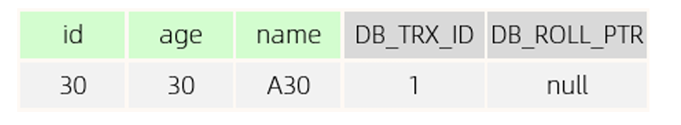

> DB_ROLL_PTR：由于这条数据新插入，所以该字段为 null

然后，四个并发事务同时在访问这张表。

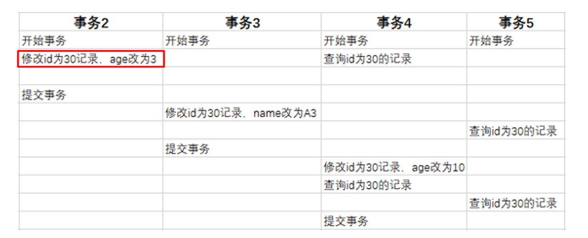

* 第一步：当事务 2 执行第一条修改语句时，会记录 undo log 日志，记录数据变更之前的样子；然后更新记录，并且记录本次操作的事务 ID，回滚指针指向修改前的版本。

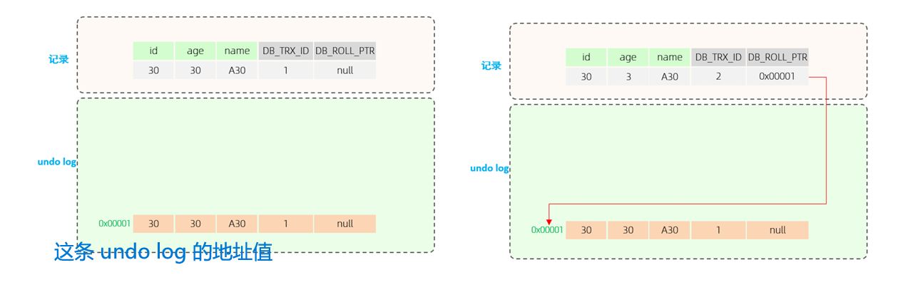

* 第二步：事务 3 执行修改语句时，同样记录 undo log，更新本次操作事务 ID，回滚指针用来指定如果发生回滚，回滚到哪一个版本。

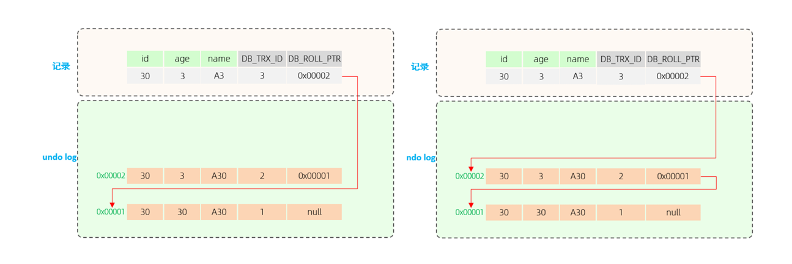

* 第三步：事务 4 执行修改语句时，同样记录 undo log，更新本次操作事务 ID，回滚指针用来指定如果发生回滚，回滚到哪一个版本。


版本链：不同事务或相同事务对同一条记录进行修改，会导致该记录的 undo log 生成一条
记录版本链表，链表的头部是最新的旧记录，链表尾部是最早的旧记录。

#### 4. readview

ReadView（读视图）是快照读 SQL执行时 MVCC 提取数据的依据，记录并维护系统当前活跃的事务（未提交的事务）id。

四个核心字段：

| 字段           | 含义                                                      |
| -------------- | --------------------------------------------------------- |
| m_ids          | 当前活跃的事务 id 集合                                    |
| min_trx_id     | 最小活跃事务 id                                           |
| max_trx_id     | 预分配事务 id，当前最大事务 id+1，也就是下一个新事务的 id |
| creator_trx_id | ReadView 创建者的事务 id                                  |

在 readview 中规定了访问版本链中数据的规则：

trx_id 表示当前 undo log 版本链中每条记录的隐藏字段对应的事务 id

| 条件                               | 是否可以访问                                          | 说明                                   |
| ---------------------------------- | ----------------------------------------------------- | -------------------------------------- |
| trx_id = creator_trx_id            | 可以访问该版本                                        | 说明数据是当前事务更改的               |
| trx_id < min_trx_id                | 可以访问该版本                                        | 说明该数据已经提交                     |
| trx_id > max_trx_id                | 不可以访问该版本                                      | 说明该事务是在 readview 生成后才开启的 |
| min_trx_id <= trx_id <= max_trx_id | 如果 trx_id 不在 m_ids 活跃事务集合中，可以访问该版本 | 说明数据已经提交                       |

不同的隔离级别，生成ReadView的时机不同：

* READ COMMITTED （只读已经提交的）：在事务中每一次执行快照读时生成 ReadView。
* REPEATABLE READ（重复读）：仅在事务中第一次执行快照读时生成ReadView，后续复用该ReadView。

综上：MVCC 的实现原理就是通过 InnoDB 表的隐藏字段、Undo Log 版本链、ReadView 来实现的。而 MVCC + 锁，则实现了事务的隔离性。 而一致性则是由redolog 与 undolog 保证。 


## 总结

今天，重点学习了数据库的视图、触发器、锁，以及事务的原理、MVCC 的实现与作用。总结下来以下几点让我印象深刻：

1. 视图是一张虚拟表，相当于将常用的 sql 存储起来，它不仅仅是方便了开发，还可以实现屏蔽敏感信息，控制用户对表的 DML
2. 触发器则可以在 DML 时进行日志记录
3. 数据库的锁相当复杂，有全局锁、表锁、行锁，总的来说手动上锁的语法只有全局锁与表锁，其他的锁都是 MySQL 根据相应 SQL 语句自动加上的
4. InnoDB 实现的行级锁实际上是在索引项上加锁，所以如果索引失效了，还是会加表锁，要避免这种情况发生
5. 间隙锁与临建锁，就是将索引值得间隙加上了锁，防止幻读现象
6. 在缓冲池中无数据的情况下，change buffer 存储非唯一二级索引的数据更改，当数据加载进缓冲池时再合并恢复
7. 理解事务的原理，本质上就是知道 ACID 是怎么实现的：原子性、一致性、持久性是通过 redo log、undo log 实现的，而隔离性由 mvcc 与 undo log 实现

