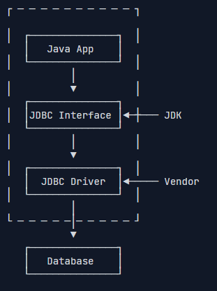

# Maven 与 JDBC

## Maven
Maven 是什么？它是一个项目的包管理工具，当我们的项目需要用到第三方包的时候，可以直接通过 maven 导入，而不是去网上找 .jar 包，将它保存到项目中的 lib 目录下。

### 坐标
项目中依赖的第三方库以及插件通过 maven 坐标唯一标识。必须的三个坐标元素：

* groupId：定义当前 maven 项目隶属的组织或公司
* artifactID：定义当前 maven 项目名
* version：当前 maven 所处版本

例子：引入阿里巴巴开源的 EasyExcel：
```xml
<dependency>
    <groupId>com.alibaba</groupId>
    <artifactId>easyexcel</artifactId>
    <version>3.1.1</version>
</dependency>
```

坐标查询网站： https://mvnrepository.com/

### 依赖

maven 依赖指 maven 构件的项目被其他项目引用，那么该项目就是其他项目的依赖。

#### 依赖配置
```xml
<project>
    <dependencies>
        <dependency>
            <groupId></groupId>
            <artifactId></artifactId>
            <version></version>
            <type>...</type>
            <scope>...</scope>
            <optional>...</optional>
            <exclusions>
                <exclusion>
                  <groupId>...</groupId>
                  <artifactId>...</artifactId>
                </exclusion>
          </exclusions>
        </dependency>
      </dependencies>
</project>
```
* dependencies：管理依赖的总标签，一个 pom.xml 文件只能有一个
* dependency：包含在总标签中，可以有多个，每一个表示当前项目的一个依赖
* 坐标：groupId、artifactId、version，必须的标签
* type(可选)：依赖的类型，对应于项目坐标定义的 packaging。大部分情况下，该元素不必声明，其默认值是 jar。
* scope(可选)：依赖的范围，默认值是 compile。
* optional(可选)：标记依赖是否可选exclusions(可选)：用来排除传递性依赖,例如 jar 包冲突

#### 依赖的范围
* compile：编译依赖范围（默认），使用此依赖范围对于编译、测试、运行三种都有效，即在编译、测试和运行的时候都要使用该依赖 Jar 包。
* test：测试依赖范围，从字面意思就可以知道此依赖范围只能用于测试，而在编译和运行项目时无法使用此类依赖，典型的是 JUnit，它只用于编译测试代码和运行测试代码的时候才需要。
* provided：对于编译和测试有效，而对运行时无效。比如 servlet-api.jar 在 Tomcat 中已经提供了，我们只需要的是编译期提供而已。
* runtime：运行时依赖范围，对于测试和运行有效，但是在编译主代码时无效，典型的就是 JDBC 驱动实现。
* system：系统依赖范围，使用 system 范围的依赖时必须通过 systemPath 元素显示地指定依赖文件的路径，不依赖 Maven 仓库解析，所以可能会造成建构的不可移植。

#### 依赖传递性与依赖冲突

1. 同一个 pom 文件下，声明多个版本的同一个依赖，只会引入后一个依赖

```xml
<dependency>
    <groupId>in.hocg.boot</groupId>
    <artifactId>mybatis-plus-spring-boot-starter</artifactId>
    <version>1.0.48</version>
</dependency>
<!-- 只会使用 1.0.49 这个版本的依赖 -->
<dependency>
    <groupId>in.hocg.boot</groupId>
    <artifactId>mybatis-plus-spring-boot-starter</artifactId>
    <version>1.0.49</version>
</dependency>
```

2. 项目的两个依赖同时传递依赖了某个依赖

​	这时，依赖的选择遵循 **路径最短优先** 和 **声明顺序优先** 两大原则，这个的过程称为 maven 依赖调解（自动解决依赖冲突）

```plain
// 最短路径优先原则会选 X（2.0）
依赖链路一：A -> B -> C -> X(1.0) // dist = 3
依赖链路二：A -> D -> X(2.0) // dist = 2

// 最短路径相同的情况下，会在 pom 中的声明顺序决定，先声明的 X（1.0）会被解析使用
依赖链路一：A -> B -> X(1.0) // dist = 2
依赖链路二：A -> D -> X(2.0) // dist = 2
```

​	排除依赖（手动解决依赖冲突）：单纯依赖 maven 进行依赖调节，在很多情况下并不适用：

```
依赖链路一：A -> B -> C -> X(1.5) // dist = 3
依赖链路二：A -> D -> X(1.0) // dist = 2
```

​	这个情况下根据最短路径优先，会选择 X 1.0 版本，但是，如果 C 依赖用到了 1.5 版本的 X 中的类，运行项目就会报错 `NoClassDefFoundError`，用到了 1.5 版本中的方法，就会报 `NoSuchMethodError`

​	这时，就需要手动将 X 1.0 版本的依赖排除：

```
<dependency>
    ......
    <exclusions>
      <exclusion>
        <artifactId>x</artifactId>
        <groupId>org.apache.x</groupId>
      </exclusion>
    </exclusions>
</dependency>
```

> 通常，在解决以来冲突问题时，都会优先保留较高版本的 jar，因为大部分 jar 在升级时会做到向下兼容。但是，如果高版本修改了低版本的类或方法，这时就不能直接保留高版本了，而是考虑优化上层依赖，例如升级上层依赖的版本。

### Maven 仓库

坐标和依赖是 maven 中的逻辑表示方式，文件实际是通过仓库来管理的，通过坐标来定位具体的存储位置。而 maven 仓库分为：

* 本地仓库：存储在本地计算机上的目录，缓存远程下载的 jar，并包含本地开发的为发布的临时构件
* 远程仓库：官方或其他组织维护的 maven 仓库
  * 中央仓库：由 maven 社区维护，存放了最大多数开源软件的包，默认配置
  * 私服：架设在局域网内的仓库服务，一般被配置为互联网远程仓库的镜像，供局域网内的用户使用
  * 其他公共仓库：为了加速访问或者部分仓库不存在中央仓库而建立的（阿里云 maven 镜像仓库）

maven 依赖包寻找顺序：

* 本地仓库
* 本地没有，去远程仓库找，找到后下载到本地
* 远程没有会报错

### Maven 生命周期

Maven 的生命周期就是为了对所有的构建过程进行抽象和统一，包含了项目的清理、初始化、编译、测试、打包、集成测试、验证、部署和站点生成等几乎所有构建步骤。

Maven 定义了三个生命周期：

* default
* clean
* site

这些生命周期相互独立，每个生命周期中包含多个阶段（phase），并且这些阶段是有序的，也就是说，后面的阶段依赖于前面的阶段，当执行某个阶段的时候，会先执行它前面的阶段。

执行 maven 生命周期的命令行格式如下：

```bash
mvn 阶段 [阶段2] ...[阶段n]
```

> 常用到的阶段：default 中的 compile、install、deploy，clean 中的 clean

### Maven 插件

Maven 本质上是一个插件执行框架，所有的执行过程，都是由一个一个插件独立完成的。像咱们日常使用到的 install、clean、deploy 等命令，其实底层都是一个一个的 Maven 插件。

除了 Maven 自带的插件之外，还有一些三方提供的插件比如单测覆盖率插件 jacoco-maven-plugin、帮助开发检测代码中不合规范的地方的插件 maven-checkstyle-plugin、分析代码质量的 sonar-maven-plugin。并且，我们还可以自定义插件来满足自己的需求。

### Maven 多模块管理

一个项目分为多个模块，每个模块只负责单一的功能实现。直观的表现就是一个 Maven 项目中不止有一个 `pom.xml` 文件，会在不同的目录中有多个 `pom.xml` 文件，进而实现多模块管理。

多模块管理下，会有一个父模块，其他的都是子模块。父模块通常只有一个 `pom.xml`，没有其他内容。父模块的 `pom.xml` 一般只定义了各个依赖的版本号、包含哪些子模块以及插件有哪些。不过，要注意的是，如果依赖只在某个子项目中使用，则可以在子项目的 pom.xml 中直接引入，防止父 pom 的过于臃肿。

### Maven 实践

#### 标准目录结构

Maven 项目的标准目录结构如下：

```groovy
src/
  main/
    java/
    resources/
  test/
    java/
    resources/
pom.xml
```

- `src/main/java`：源代码目录
- `src/main/resources`：资源文件目录
- `src/test/java`：测试代码目录
- `src/test/resources`：测试资源文件目录

实际项目中，还会根据项目规范进一步细分。

#### 有效管理依赖关系

Maven 的依赖管理系统是其最强大的功能之一。在顶层 pom 文件中，通过标签 `dependencyManagement` 定义公共的依赖关系，这有助于避免冲突并确保所有模块使用相同版本的依赖项。

例如：我们有一个父模块和两个子模块 A 和 B，想要在所有模块中使用 JUnit 5.7.2 作为测试框架。我们可以在父模块的`pom.xml`文件中使用`<dependencyManagement>`标签来定义 JUnit 的版本：

```xml
<dependencyManagement>
  <dependencies>
    <dependency>
      <groupId>org.junit.jupiter</groupId>
      <artifactId>junit-jupiter</artifactId>
      <version>5.7.2</version>
      <scope>test</scope>
    </dependency>
  </dependencies>
</dependencyManagement>
```

在子模块 A 和 B 的 pom.xml 文件中，只需要引用 JUnit 的 groupId 和 artifactId 即可：

```xml
<dependencies>
  <dependency>
    <groupId>org.junit.jupiter</groupId>
    <artifactId>junit-jupiter</artifactId>
  </dependency>
</dependencies>
```

#### 针对不同环境使用配置文件

Maven 配置文件允许我们配置不同环境的构建设置，例如开发、测试和生产。在 `pom.xml` 文件中定义配置文件并使用命令行参数激活它们：

```xml
<profiles>
  <profile>
    <id>development</id>
    <activation>
      <activeByDefault>true</activeByDefault>
    </activation>
    <properties>
      <environment>dev</environment>
    </properties>
  </profile>
  <profile>
    <id>production</id>
    <properties>
      <environment>prod</environment>
    </properties>
  </profile>
</profiles>
```

使用命令行激活配置文件：

```bash
mvn clean install -P production
```

#### 保持 pom.xml 干净有序

组织良好的 `pom.xml` 文件更易于维护和理解。以下是维护干净的 `pom.xml` 的一些技巧：

* 将相似的依赖项和插件组合在一起。
* 使用注释来描述特定依赖项或插件的用途。
* 将插件和依赖项的版本号保留在 `<properties>` 标签内以便于管理。

```xml
<properties>
  <junit.version>5.7.0</junit.version>
  <mockito.version>3.9.0</mockito.version>
</properties>

<dependencies>
        <dependency>
            <groupId>mysql</groupId>
            <artifactId>mysql-connector-java</artifactId>
            <version>${mysql.version}</version>
        </dependency>
</dependencies>
```


## JDBC

JDBC 是 Java Database Connectivity 的缩写，它是 Java 程序访问数据库的标准接口。

使用 Java 程序访问数据库时，Java 代码并不是直接通过 TCP 连接去访问数据库，而是通过 JDBC 接口来访问，而 JDBC 接口则通过 JDBC 驱动来实现真正对数据库的访问。JDBC 接口是 Java 标准库自带的，在 sql 包中，可以直接编译，而具体的驱动实现是由数据库厂商提供的，因此，访问某个具体的数据库，只需要引入该厂商提供的 JDBC 驱动即可，这样保证了 Java 程序编写一套数据库访问代码，却可以用相同的访问逻辑访问各种不同数据库。



> 实际上 MySQL 的 JDBC 驱动（实现类）就是一个 jar 包，它本身也是纯 Java 编写的，所有复杂的连接 mysql 服务的网络通讯都封装在 JDBC 驱动中。
>
> 由于是 jar 包，就用到了 maven 来管理依赖，再添加 mysql 驱动依赖时注意，**依赖作用范围要限制在 runtime**，为编译Java程序并不需要MySQL的这个jar包，只有在运行期才需要使用。如果把`runtime`改成`compile`，虽然也能正常编译，但是在IDE里写程序的时候，会多出来一大堆类似`com.mysql.jdbc.Connection`这样的类，非常容易与Java标准库的JDBC接口混淆，所以坚决不要设置为`compile`。

### JDBC 查询

#### JDBC 连接

Connection代表一个JDBC连接，它相当于Java程序到数据库的连接（通常是TCP连接）。打开一个Connection时，需要准备URL、用户名和口令，才能成功连接到数据库（这和命令行建立连接类似，也需要用户名和口令）

* URL：由数据库厂商指定的格式，例如，MySQL的URL是：

```
jdbc:mysql://<hostname>:<port>/<db>?key1=value1&key2=value2
```

假设数据库运行在本机 `localhost`，端口使用默认的 3306，数据库名是 db01，则 URL 如下

```
jdbc:mysql://localhost:3306/db01?useSSL=false&characterEncoding=utf8
```

后面的两个参数表示不使用SSL加密，使用UTF-8作为字符编码（注意MySQL的UTF-8是`utf8`）。

整个获取连接的代码如下：

```java
// JDBC连接的URL, 不同数据库有不同的格式:
String JDBC_URL = "jdbc:mysql://localhost:3306/db01";
String JDBC_USER = "root";
String JDBC_PASSWORD = "password";
// 获取连接:
Connection conn = DriverManager.getConnection(JDBC_URL, JDBC_USER, JDBC_PASSWORD);
// TODO: 访问数据库...
// 关闭连接:
conn.close();
```

> 因为 JDBC 连接是昂贵的资源，每次连接后要及时释放，使用 try(resource) 来自动释放 JDBC 是推荐的方法

#### JDBC 查询

获取到JDBC连接后，下一步我们就可以查询数据库了。查询数据库分以下几步：

第一步，通过`Connection`提供的`createStatement()`方法创建一个`Statement`对象，用于执行一个查询；

第二步，执行`Statement`对象提供的`executeQuery("SELECT * FROM students")`并传入SQL语句，执行查询并获得返回的结果集，使用`ResultSet`来引用这个结果集；

第三步，反复调用`ResultSet`的`next()`方法并读取每一行结果。

完整代码如下：

```java
		// 加载驱动
        Class.forName("com.mysql.cj.jdbc.Driver");
        // 获取连接
        try (Connection conn = DriverManager.getConnection(URL, USER, PASSWORD)) {
            // 数据库操作
            try (PreparedStatement statement = conn.prepareStatement("select name,age from tb_user where id <= ?")) {
                statement.setObject(1,20);
                try (ResultSet rs = statement.executeQuery()) {
                    while (rs.next()) {
                        System.out.println(rs.getString("name") + " 年龄：" + rs.getString("age"));
                    }
                }
            }
        }
```

> statemen 和 resultset 都是需要关闭的资源，因此嵌套使用 tre(resource) 确保及时关闭
>
> `ResultSet`获取列时，可以通过索引，索引从`1`开始而不是`0`；也可以通过字段名

#### SQL 注入

使用 statement 拼接字符串非常容易引发 sql 注入，例如：

```java
// 用户登录验证的方法
User login(String name, String pass) {
    ...
    stmt.executeQuery("SELECT * FROM user WHERE login='" + name + "' AND pass='" + pass + "'");
    ...
}
```

为了避免这种情况，需要将 statement 对象替换为 PreparedStatement，它可以完全避免 sql 注入攻击，因为它使用了 ？ 作为占位符，并且连同参数同 sql 本身传给了数据库，这样可以保证每次传给数据库的SQL语句是相同的，只是占位符的数据不同，还能高效利用数据库本身对查询的缓存。

> 注意到JDBC查询的返回值总是`ResultSet`，即使我们写这样的聚合查询`SELECT SUM(score) FROM ...`，也需要按结果集读取.

#### 数据类型转换

MySQL 的数据与 java 中的数据不同，需要进行数据类型转化，JDBC在`java.sql.Types`定义了一组常量来表示如何映射SQL数据类型，但是平时我们使用的类型通常也就以下几种：

| SQL数据类型   | Java数据类型             |
| ------------- | ------------------------ |
| BIT, BOOL     | boolean                  |
| INTEGER       | int                      |
| BIGINT        | long                     |
| REAL          | float                    |
| FLOAT, DOUBLE | double                   |
| CHAR, VARCHAR | String                   |
| DECIMAL       | BigDecimal               |
| DATE          | java.sql.Date, LocalDate |
| TIME          | java.sql.Time, LocalTime |

#### 小结

使用 JDBC 查询三步：

* 加载驱动：`Class.forname("com.mysql.cj.jdbc.Driver")`
* 建立连接：`Connection conn = DriverManager.getConnection(URL, USER, PASSWORD)`
* 通过 PreparedStatement 对象操作数据库：`PreparedStatement statement = conn.prepareStatement("select ...")`
* 通过 `ResultSet` 接收查询结果集：`ResultSet rs = statement.executeQuery()`

### JDBC 更新

JDBC 更新包括了 UPDATE、INSERT、DELETE

### 插入

通过JDBC进行插入，本质上也是用`PreparedStatement`执行一条SQL语句，不过最后执行的不是`executeQuery()`，而是`executeUpdate()`，其返回值表示影响的记录数量

#### 插入并获取主键

如果数据库的表设置了自增主键，那么在执行`INSERT`语句时，并不需要指定主键，数据库会自动分配主键。对于使用自增主键的程序，获取插入后的自增主键的值是业务中常用到的。

自然的做法是先插入，再查询，这是不可行的。一方面，效率低，另一方面，两条 sql 执行期间有可能别的程序也插入了相同的字段值。正确的做法是再创建 PreparedStatement 时，指定标志位 RETURN_GENERATED_KEYS，表示 JDBC 驱动必须返回插入的自增主键：

```java
PreparedStatement ps = conn.prepareStatement(
            "INSERT INTO students (grade, name, gender) VALUES (?,?,?)",
            Statement.RETURN_GENERATED_KEYS)
```

返回的主键同样用 ResultSet 结果集接收：

```java
try (ResultSet rs = ps.getGeneratedKeys()) {
        while(rs.next())
}
```

#### 更新

更新操作是`UPDATE`语句，它可以一次更新若干列的记录。更新操作和插入操作在 JDBC 代码的层面上实际上没有区别，除了SQL语句不同，`executeUpdate()`返回数据库实际更新的行数。返回结果可能是正数，也可能是0（表示没有任何记录更新）。

#### 删除

删除操作是`DELETE`语句，它可以一次删除若干行。和更新一样，除了SQL语句不同外，JDBC代码都是相同的


### JDBC 事务

数据库事务（Transaction）是由若干个SQL语句构成的一个操作序列，有点类似于Java的`synchronized`同步。数据库系统保证在一个事务中的所有SQL要么全部执行成功，要么全部不执行。

要在JDBC中执行事务，本质上就是如何把多条SQL包裹在一个数据库事务中执行。直接来看JDBC的事务代码：

```java
Connection conn = openConnection();
//如果要设定事务的隔离级别，可以使用如下代码：
conn.setTransactionIsolation(Connection.TRANSACTION_READ_COMMITTED);
try {
    // 关闭自动提交:
    conn.setAutoCommit(false);
    // 执行多条SQL语句:
    insert(); update(); delete();
    // 提交事务:
    conn.commit();
} catch (SQLException e) {
    // 回滚事务:
    conn.rollback();
} finally {
    conn.setAutoCommit(true);
    conn.close();
}
```

### JDBC 批处理

通过一个循环来执行每个`PreparedStatement`虽然可行，但是性能很低。SQL数据库对SQL语句相同，但只有参数不同的若干语句可以作为batch执行，即批量执行，这种操作有特别优化，速度远远快于循环执行每个SQL。

在JDBC代码中，我们可以利用SQL数据库的这一特性，把同一个SQL但参数不同的若干次操作合并为一个batch执行。我们以批量插入为例，示例代码如下：

```java
try (PreparedStatement ps = conn.prepareStatement("INSERT INTO students (name, gender, grade, score) VALUES (?, ?, ?, ?)")) {
    // 对同一个PreparedStatement反复设置参数并调用addBatch():
    for (Student s : students) {
        ps.setString(1, s.name);
        ps.setBoolean(2, s.gender);
        ps.setInt(3, s.grade);
        ps.setInt(4, s.score);
        ps.addBatch(); // 添加到batch
    }
    // 执行batch:
    int[] ns = ps.executeBatch();
    for (int n : ns) {
        System.out.println(n + " inserted."); // batch中每个SQL执行的结果数量
    }
}
```

> 执行batch和执行一个SQL不同点：
>
> * 调用的不是`executeUpdate()`，而是`executeBatch()`，因为我们设置了多组参数
> * 返回结果也是多个`int`值，因此返回类型是`int[]`，循环`int[]`数组即可获取每组参数执行后影响的结果数量。

### JDBC 连接池（重要）

创建线程是一个昂贵的操作，如果有大量的小任务需要执行，并且频繁地创建和销毁线程，实际上会消耗大量的系统资源，往往创建和消耗线程所耗费的时间比执行任务的时间还长，所以，为了提高效率，引入了线程池。

类似的，在执行JDBC的增删改查的操作时，如果每一次操作都来一次打开连接，操作，关闭连接，那么创建和销毁JDBC连接的开销就太大了。为了避免频繁地创建和销毁JDBC连接，我们可以通过连接池（Connection Pool）复用已经创建好的连接。

JDBC连接池有一个标准的接口`javax.sql.DataSource`，注意这个类位于Java标准库中，但仅仅是接口。要使用JDBC连接池，我们必须选择一个JDBC连接池的实现。常用的JDBC连接池有：

- HikariCP
- C3P0
- BoneCP
- Druid

以HikariCP为例，要使用JDBC连接池，先添加HikariCP的依赖如下：

- com.zaxxer:HikariCP:2.7.1

接着创建 `DataSource`实例，这个实例就是连接池：

```java
// 设置必要的配置信息
HikariConfig config = new HikariConfig();
config.setJdbcUrl("jdbc:mysql://localhost:3306/db01");
config.setUsername("root");
config.setPassword("password");
config.addDataSourceProperty("connectionTimeout", "1000"); // 连接超时：1秒
config.addDataSourceProperty("idleTimeout", "60000"); // 空闲超时：60秒
config.addDataSourceProperty("maximumPoolSize", "10"); // 最大连接数：10
// 新建连接池对象
DataSource ds = new HikariDataSource(config);
```

> 注意创建`DataSource`也是一个非常昂贵的操作，所以通常`DataSource`实例总是作为一个全局变量存储，并贯穿整个应用程序的生命周期。

连接池的使用，获取池中连接：

```
try (Connection conn = ds.getConnection()) { // 在此获取连接
    ...
} // 在此自动“关闭”连接
```

> 通过连接池获取连接时，并不需要指定JDBC的相关URL、用户名、口令等信息，因为这些信息已经存储在连接池内部了（创建`HikariDataSource`时传入的`HikariConfig`持有这些信息）。一开始，连接池内部并没有连接，所以，第一次调用`ds.getConnection()`，连接池内部先创建一个`Connection`，再返回给客户端使用。当我们调用`conn.close()`方法时（`在try(resource){...}`结束处），不是真正“关闭”连接，而是释放到连接池中，以便下次获取连接时能直接返回。
>
> 因此，连接池内部维护了若干个`Connection`实例，如果调用`ds.getConnection()`，就选择一个空闲连接，并标记它为“正在使用”然后返回，如果对`Connection`调用`close()`，那么就把连接再次标记为“空闲”从而等待下次调用。这样一来，我们就通过连接池维护了少量连接，但可以频繁地执行大量的SQL语句。
>
> 通常连接池提供了大量的参数可以配置，例如，维护的最小、最大活动连接数，指定一个连接在空闲一段时间后自动关闭等，需要根据应用程序的负载合理地配置这些参数。此外，大多数连接池都提供了详细的实时状态以便进行监控。
